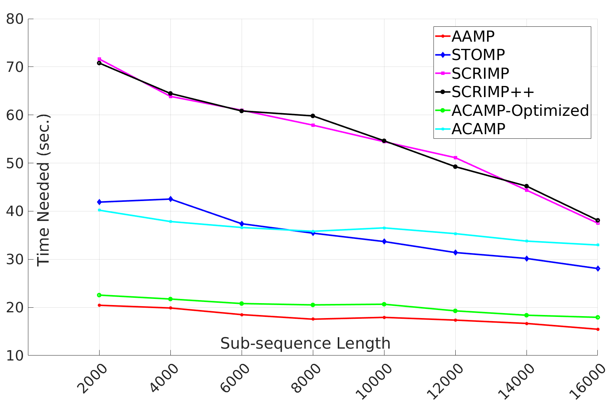
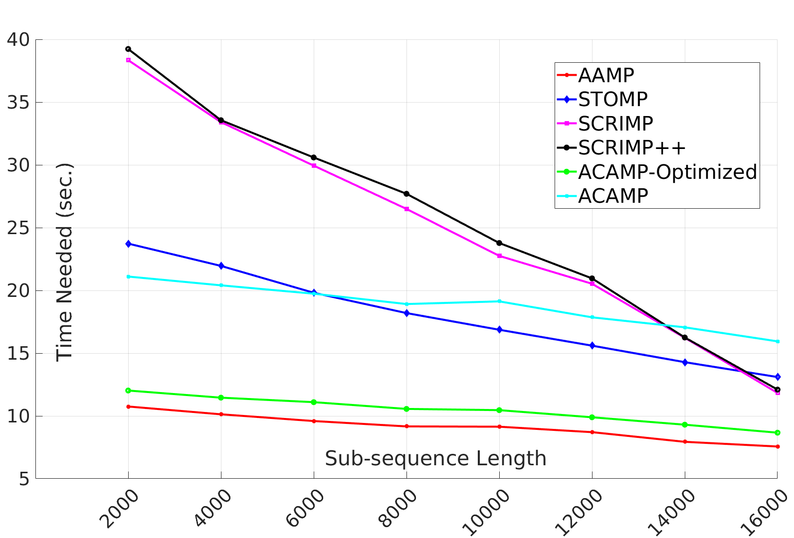
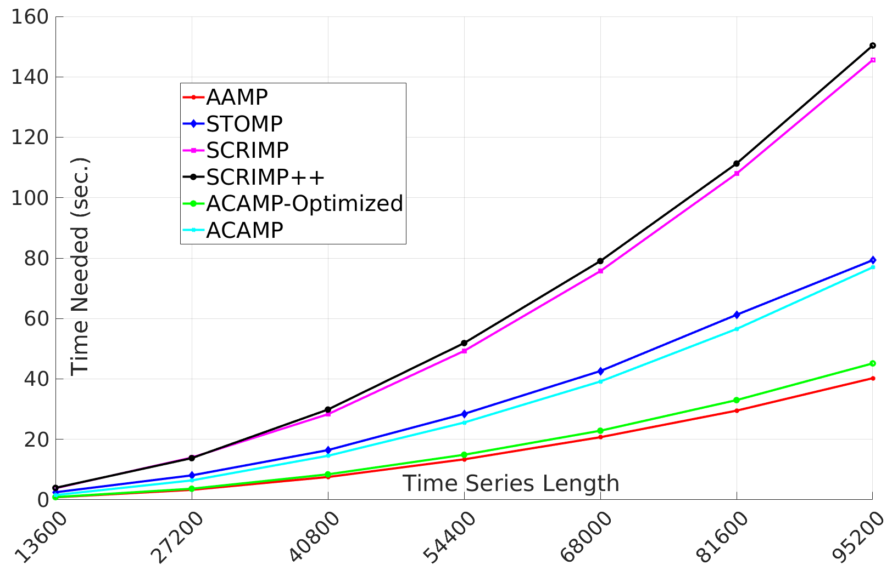
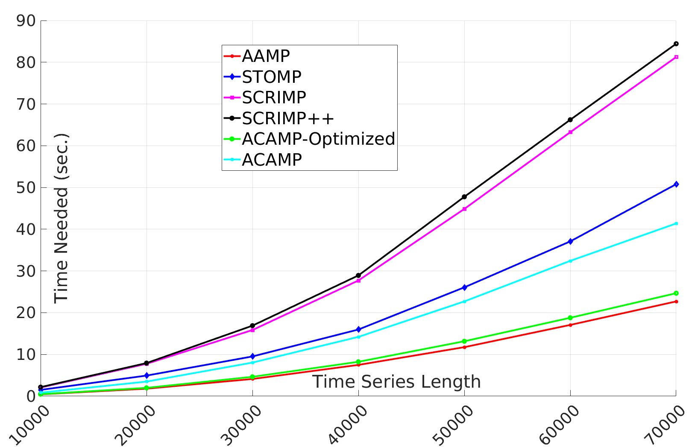
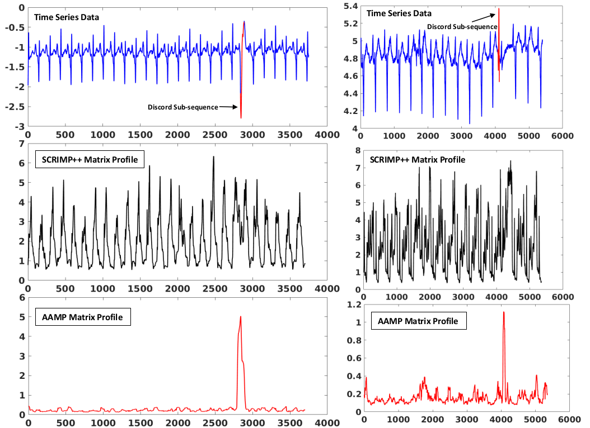
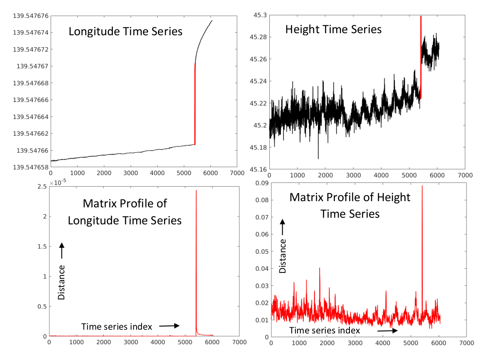
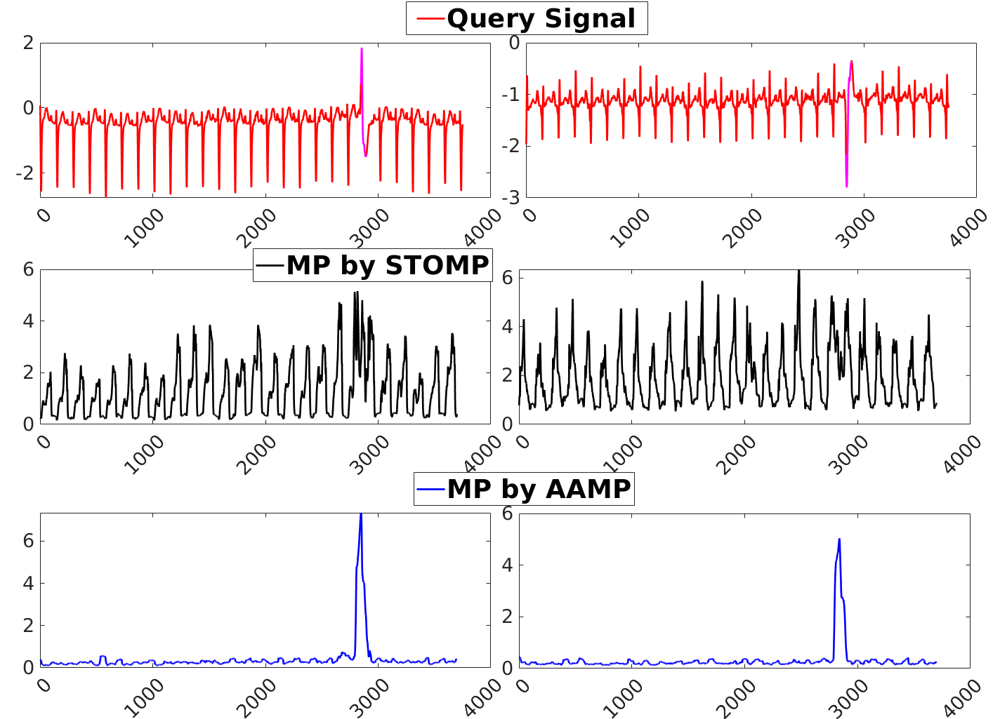
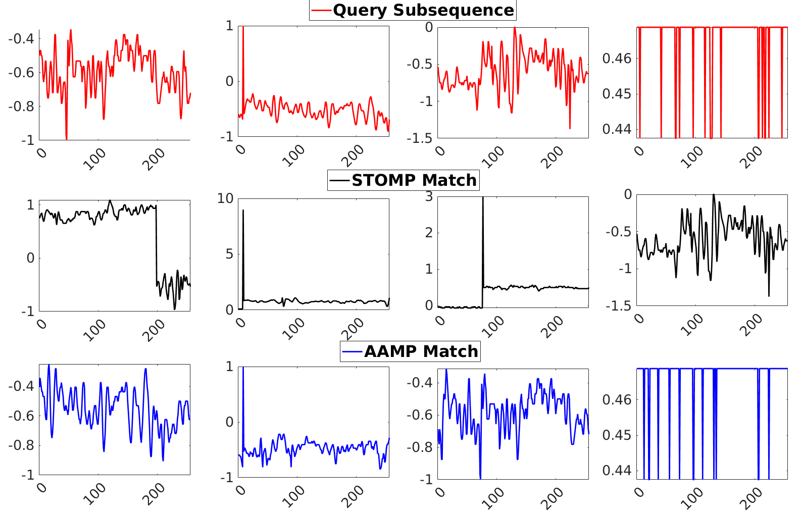

<p align="center">
  AAMP and ACAMP Algorithms </p>
<h1> Quick-Matrix-Profile </h1>   <br/> 

We propose efficient algorithms for computing matrix profile for a general class of Euclidean distances. We first propose a simple but efficient algorithm called AAMP for computing matrix profile with the classical (non-normalized) Euclidean distance. 

Then, we extend our algorithm for the p-norm distance. We also propose two algorithms called ACAMP and ACAMP-Optimized that use the same principle as AAMP, but for calculating matrix profile by using z-normalized Euclidean distance

To show the better outlier detection capabilities of AAMP and ACAMP over STOMP algorithm on ECG dataset:
```matlab
-- ECG_Journal_Exp.m
```

To show the better outlier detection capabilities of AAMP and ACAMP over STOMP algorithm on Seismic dataset:
```matlab
-- IGS_Work.m
```
Compute the change in :
* Comutational time with the increase of sub-sequence length i.e. m. 
* Comutational time with the increase of time series length i.e. n 

```matlab
-- test_AAMP_subSeq.m
-- test_AAMP_SeriesLen.m
```

Here, we can obtain the computational time of the following algorithms : 
  1. STOMP
  2. SCRIMP
  3. SCRIMP++
  4. AAMP
  5. ACAMP
  6. ACAMP Optimized

  
 
Fig. The execution times of six algorithms with increasing the subsequence length (m): Top Left) Execution time of the six algorithms on a time series of length 68000 (protein dataset). Top Right) Execution time of the six algorithms on a time series of length 50000 (sheep dataset). 
The execution time of six algorithms are plotted with the increase of time series length (n): c) Execution time of the six algorithms on variable time series length (protein dataset) with m = 256. d) execution time of the six algorithms on variable time series length (sheep dataset) with m = 256.

&nbsp;

<p align="center">
  
</p>
Fig. Top) Two time series from real ECG dataset. The visible discords in these time series are marked by red color. Middle) The matrix profile, obtained by SCRIMP++ algorithm; Bottom:) The matrix profile, obtained by AAMP algorithm.

&nbsp;

<p align="center">
  
</p>
Fig. Top) The time series of Seismic dataset (outliers are marked by red color). Bottom) The matrix profile obtained by AAMP algorithm. 

&nbsp;

<p align="center">
  
</p>
Fig. Top) Example of two different time series from ECG dataset; Middle) Matrix profile generated by z-normalized Euclidean distance, using STOMP; Bottom) Matrix profile generated by non-normalized Euclidean distance, using AAMP.

&nbsp;

<p align="center">
  
</p>
Fig. Top) Four subsequences of length 50 from sheep dataset; Middle) The nearest neighbors obtained by STOMP; Bottom) The nearest neighbors obtained by AAMP are in the same range as the queries, while the results obtained by STOMP are in very different ranges.